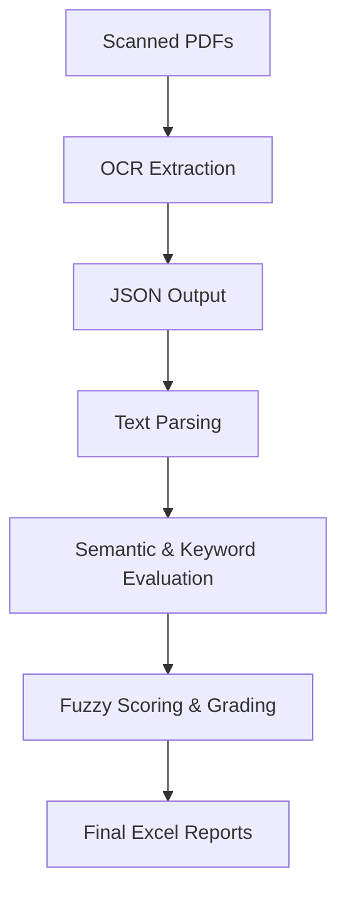

# AI-Driven Online Subjective Answer Evaluator

This project provides an automated solution for evaluating handwritten or scanned subjective answer scripts. It leverages Optical Character Recognition (OCR), Natural Language Processing (NLP), and hybrid scoring techniques (Semantic + Keywords) to streamline the grading process.

## 🚀 Key Features
- **OCR Integration:** Extract handwritten text from scanned PDFs using Google Cloud Vision API.
- **Hybrid Evaluation:** Combines SBERT-based semantic similarity with keyword matching.
- **Auto-Grading:** Automatically calculates scores, rounds them, and assigns grades.
- **Comprehensive Reporting:** Generates detailed Excel reports covering parsing, scoring, and confidence metrics.

## 🏗️ System Architecture



## 📋 Project Workflow

1.  **OCR Extraction (`ocr_extraction.py`):** Converts PDFs to images and uses Google Cloud Vision to extract text into structured JSON files.
2.  **Parsing (`text_parser.py`):** Matches extracted text to specific question numbers based on formatting.
3.  **Semantic Scoring (`semantic_scoring.py` / `trainingmodel.py`):**
    *   **Semantic Similarity:** Uses SBERT (`all-MiniLM-L6-v2`) to compare the meaning of the student's answer vs. the model answer.
    *   **Keyword Relevance:** Checks for essential keywords and their synonyms using NLTK WordNet.
4.  **Grading (`main.py`):** Aggregates scores, applies fuzzy logic for crisp scores, and generates final grade sheets.

## ⚙️ How to Run Locally

### 1. Prerequisites
- **Python 3.9+**
- **Tesseract OCR:** [Download and Install](https://github.com/UB-Mannheim/tesseract/wiki) (Add to system PATH)
- **Poppler:** Required for `pdf2image`. [Download for Windows](https://github.com/oschwartz10612/poppler-windows/releases/) and add the `bin/` folder to your system PATH.
- **Google Cloud Vision API:**
    - Create a project on [Google Cloud Console](https://console.cloud.google.com/).
    - Enable the "Cloud Vision API".
    - Create a Service Account, download the JSON key, and set the environment variable:
      ```powershell
      $env:GOOGLE_APPLICATION_CREDENTIALS="C:\path\to\your\key.json"
      ```

### 2. Install Dependencies
```bash
pip install -r requirements.txt
python -m nltk.downloader wordnet punkt popular
```

### 3. OCR Extraction
Place your answer sheet PDFs in `data/pdf/` and run:
```bash
python ocr_extraction.py
```
This will:
1. Convert PDFs to preprocessed images in `outputs/images/`.
2. Extract text using Google Vision and save JSONs in `data/json/`.

### 5. Visualizing with the Dashboard
To view a rich visual summary of the results:
```bash
streamlit run dashboard.py
```
The dashboard allows you to:
- Monitor overall class performance and grade distribution.
- Drill down into individual student answers.
- Compare student responses against semantic similarity thresholds.

## 📂 Directory Structure
- `data/pdf/`: Input handwritten answer sheets (PDF).
- `data/json/`: OCR extracted text (JSON).
- `model_answer.json`: The model answer script with keywords.
- `outputs/`: Final evaluation reports (Excel).

## 📓 Training and Evaluation Notebook
For training the custom SBERT model or running evaluations in a Jupyter/Colab environment, refer to:
[Evaluation_Model_Training.ipynb](file:///c:/Users/lobop/OneDrive/Desktop/PRAJWAL/SEM%206/AI_ML_based_Online_subjective_Answers_Evaluator/Online-Subjective-answers-evaluator-AI-main/Evaluation_Model_Training.ipynb) (to be created)

## 📊 Evaluation Logic
The final similarity score is a weighted combination:
- **80% Semantic Similarity:** Deep contextual understanding of the answer.
- **20% Keyword Relevance:** Ensuring critical technical terms are present.

Total Score is then processed through a fuzzy logic layer to output "Crisp Scores" suitable for academic grading.
